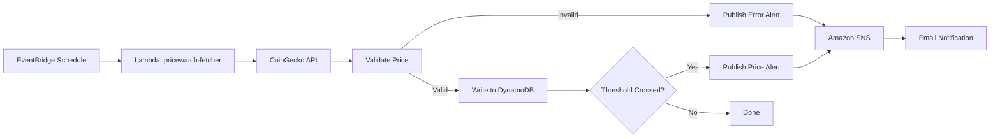

# 🚀 PriceWatch — Serverless Crypto Price Monitoring Pipeline with CI/CD

<p align="center">
A production-style <b>Serverless Data Pipeline</b> built on AWS that automatically fetches live cryptocurrency prices on a schedule, validates each record, stores price history in Amazon DynamoDB, and sends real-time email alerts via Amazon SNS — fully automated with a CI/CD pipeline powered by GitHub Actions.
</p>

<p align="center">
  
  
  
  
</p>

<p align="center">
  
  
  
</p>

---

## 🏗️ Architecture Overview

```text
                    PRICEWATCH SERVERLESS PIPELINE

                                  GitHub
                                     │
                              git push (main)
                                     ▼
                          GitHub Actions (CI/CD)
                       Zip • Deploy • Version • Alias
                                     │
                                     ▼
                            AWS Lambda (prod alias)
──────────────────────────────────────────────────────────────────────

      Amazon EventBridge
      (rate(15 minutes))
             │
        triggers
             ▼
       AWS Lambda Function
      (pricewatch-fetcher)
             │
      Calls CoinGecko API
             │
             ▼
       Validate each price
             │
     ┌───────┴────────┐
     │                │
     ▼                ▼
  Valid Price     Invalid / Threshold
     │                │
     ▼                ▼
Amazon DynamoDB    Amazon SNS
 (crypto-prices)   (pricewatch-alerts)
     │                │
     ▼                ▼
Amazon CloudWatch    Email Alert
      Logs
```

---

## Project Overview

This project demonstrates a **Serverless, event-driven data pipeline** built on AWS for monitoring live cryptocurrency prices, with a fully automated CI/CD release process.

### Features

- Scheduled, event-driven ETL using Amazon EventBridge + AWS Lambda
- Live price data fetched from the public CoinGecko API (no API key required)
- Per-record data validation before anything is persisted
- Clean price history stored in Amazon DynamoDB
- Real-time email alerts via Amazon SNS on threshold breaches or validation failures
- Zero-downtime deployments using Lambda **versions + aliases**
- Fully automated deploys via **GitHub Actions** on every push
- Least-privilege IAM roles, separate for the Lambda runtime and the CI/CD deployer

### Workflow

```text
EventBridge Schedule (every 15 min)
      │
      ▼
AWS Lambda (pricewatch-fetcher:prod)
      │
      ▼
CoinGecko API (live USD prices)
      │
      ▼
Validate → Clean → Convert to Decimal
      │
      ▼
Amazon DynamoDB (crypto-prices)
      │
      ▼
Amazon SNS → Email (on alert / on error)
      │
      ▼
Amazon CloudWatch Logs
```

---

## ETL Workflow



| Stage | Description |
|--------|-------------|
| Trigger | Amazon EventBridge invokes the Lambda function every 15 minutes |
| Extract | Lambda calls the public CoinGecko API for live USD prices |
| Validate | Each coin's response is checked for presence and a sane positive price |
| Load | Valid prices are written to DynamoDB with a `coin_id` + `timestamp` key |
| Alert | Amazon SNS emails a notification if a price threshold is crossed, or if validation fails |
| Audit | Execution logs are captured in Amazon CloudWatch |

---

## AWS Services Used

| Service | Purpose |
|----------|---------|
| AWS Lambda | Runs the fetch → validate → save → alert logic |
| Amazon EventBridge | Triggers the Lambda function on a 15-minute schedule |
| Amazon DynamoDB | Stores price history (`crypto-prices` table) |
| Amazon SNS | Sends email alerts for price thresholds and validation errors |
| Amazon CloudWatch | Captures Lambda execution logs for debugging and audit |
| AWS IAM | Least-privilege roles — one for the Lambda runtime, one for CI/CD deploys |
| GitHub | Source code management |
| GitHub Actions | Continuous Integration & Continuous Deployment |

---

## Lambda Function

| Function | Role |
|-----------|------|
| `pricewatch-fetcher` | Triggered by EventBridge; fetches live prices, validates them, writes to DynamoDB, and publishes SNS alerts when needed |

**Code structure inside the function:**

| File | Responsibility |
|------|-----------------|
| `lambda_function.py` | Orchestration — calls the API, loops through coins, writes to DynamoDB, publishes to SNS |
| `transform.py` | Pure validation/business logic (`validate_price`, `crossed_threshold`) — unit-testable without any AWS dependency |

---

## DynamoDB Table Design

- **Table Name:** `crypto-prices`
- **Partition Key:** `coin_id` (String)
- **Sort Key:** `timestamp` (String, ISO 8601)
- **Capacity Mode:** On-demand (`PAY_PER_REQUEST`)
- **Additional Fields:** `price_usd` (Decimal), `source_key`

---

## Deployment Strategy — Versions & Aliases

Every deploy publishes a new, permanent, numbered **Lambda version** and then points the `prod` **alias** to it. EventBridge always invokes `pricewatch-fetcher:prod`, never `$LATEST`. This means:

- A bad deploy never touches the live, running version until the alias is explicitly moved
- Rolling back is a single command: point `prod` back to the previous version number
- The same pattern is used identically by the local `deploy.bat` script and the GitHub Actions workflow

---

## CI/CD Pipeline

Two ways to deploy, both following the exact same steps:

| Method | Trigger | Use case |
|--------|---------|----------|
| `deploy.bat` | Run manually from the command line | Local development, quick iteration |
| `.github/workflows/deploy.yml` | Automatic on `git push` to `main` (when `lambda/pricewatch/**` changes) | Production-style automated CI/CD |

**Pipeline steps (both methods):**
```text
Zip code → Update Lambda code → Wait for update → 
Publish new version → Point "prod" alias to it → Verify with a test invoke
```

GitHub Actions authenticates using a dedicated IAM user (`pricewatch-github-deployer`) with permissions scoped to only this one Lambda function, stored as encrypted GitHub repository secrets — never committed to code.

---

## Project Structure

```text
PriceWatch/
│
├── .github/
│   └── workflows/
│       └── deploy.yml
│
├── lambda/
│   └── pricewatch/
│       ├── lambda_function.py
│       └── transform.py
│
├── screenshots/
│   ├── dynamodb.png
│   ├── sns-email.png
│   ├── eventbridge-rule.png
│   ├── github-actions.png
│   └── lambda-versions.png
│
├── trust-policy.example.json
├── permissions-policy.example.json
├── environment.example.json
├── targets.example.json
├── deploy.bat
├── .gitignore
└── README.md
```

---

## Project Screenshots

### Amazon EventBridge Rule

Scheduled rule firing every 15 minutes, targeting the `prod` alias of the Lambda function.

<p align="center">

</p>

---

### AWS Lambda — Versions & Alias

Published versions with the `prod` alias pointing to the current live version, demonstrating the zero-downtime deployment pattern.

<p align="center">

</p>

---

### Amazon DynamoDB

Live price history stored in the `crypto-prices` table, with `coin_id` + `timestamp` as the composite key.

<p align="center">

</p>

---

### GitHub Actions

Automated CI/CD workflow executing the full deploy sequence — zip, deploy, publish version, update alias, and verify — on every push.

<p align="center">

</p>

---

## Running Locally

Clone the repository:

```bash
git clone https://github.com/AnkitVishwakarma4591/pricewatch-aws-serverless-pipeline.git
```

Move into the project directory:

```bash
cd pricewatch-aws-serverless-pipeline
```

Validate the Lambda functions locally:

```bash
python -m py_compile lambda/pricewatch/lambda_function.py
python -m py_compile lambda/pricewatch/transform.py
```

Deploy manually (requires AWS CLI configured):

```bash
deploy.bat
```

---

## 🚀 Future Improvements

- Add an **Amazon SQS dead-letter queue** to capture and replay failed records instead of just alerting on them.
- Add a dedicated **CloudWatch Alarm** on the Lambda error rate, separate from application-level SNS alerts.
- Move from manual AWS CLI setup to **Infrastructure as Code** (AWS SAM or Terraform) for one-command, reproducible environment creation.
- Add **unit tests** for `transform.py` using `pytest`, with AWS calls mocked via `moto`.
- Track additional coins and add a lightweight dashboard to visualize price history from DynamoDB.

---

## Author

**Ankit Vishwakarma**

- GitHub: https://github.com/AnkitVishwakarma4591

If you found this project helpful, consider giving it a ⭐ on GitHub.